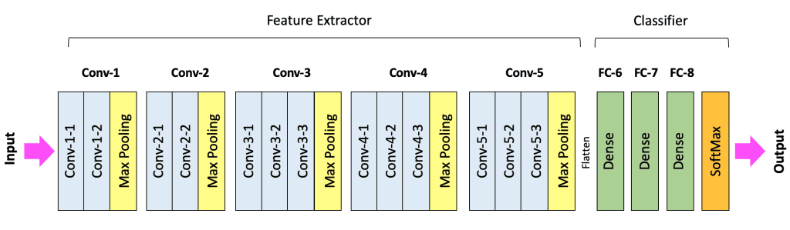

# 인공 지능의 깊은 사고를 가능하게 하는 설계, 레이어(Layer)의 이해

인공 지능 기술이 눈부시게 발전하며 모델의 크기는 나날이 거대해지고 있습니다. 이러한 발전의 중심에는 단순히 파라미터의 숫자를 늘리는 것을 넘어 데이터가 흐르는 통로인 레이어 즉, 층을 어떻게 설계하느냐라는 아키텍처의 고민이 담겨 있습니다. 오늘은 인공 신경망의 뼈대를 이루는 각 레이어가 어떤 수학적 원리로 작동하며 우리가 왜 층을 깊게 쌓아야 하는지 전문가의 시선에서 상세히 살펴보겠습니다.

## 1. 심층 학습의 본질 딥러닝이라는 이름의 이유

우리가 흔히 말하는 딥러닝 즉 심층 학습이라는 단어에서 심층은 레이어가 수직으로 깊게 쌓여 있다는 것을 의미합니다. 과거의 인공 지능은 층이 얕아서 복잡한 데이터의 특징을 제대로 잡아내지 못했습니다. 하지만 현대의 프론티어 모델들은 수십 층에서 수백 층에 달하는 은닉층을 가집니다.

이렇게 층을 깊게 쌓는 이유는 데이터 안에 숨겨진 아주 미세하고 복잡한 패턴을 단계적으로 추출하기 위해서입니다. 모델이 커질수록 성능이 좋아진다는 스케일링 법칙은 바로 이러한 레이어의 깊이와 너비가 확장될 때 데이터 처리 능력이 비약적으로 상승한다는 점에 기인합니다.

## 2. 입력층 - 데이터가 수치화되는 관문

모든 인공 신경망의 시작은 입력층입니다. 이곳은 이미지나 텍스트 그리고 음성과 같은 현실 세계의 데이터가 모델이 이해할 수 있는 수치 집합인 벡터 형태로 처음 들어오는 곳입니다 

입력층은 보통 학습을 위한 별도의 파라미터를 가지지 않지만 입력되는 데이터의 차원을 결정하는 매우 중요한 역할을 합니다. 예를 들어 28x28 크기의 이미지는 784개의 입력 뉴런으로 변환되어 들어옵니다. 이 단계에서 데이터는 정규화라는 과정을 거치며 신경망이 학습하기 가장 좋은 형태의 분포로 다듬어집니다. 이는 마치 거대한 공장에 원재료가 입고될 때 규격에 맞게 분류하는 과정과 같습니다.

## 3. 은닉층 - 추상화와 특징 추출의 연금술

입력층을 통과한 데이터는 본격적으로 은닉층이라는 미로에 진입합니다. 은닉층은 인공 지능의 실제 지능이 형성되는 핵심적인 공간입니다. 이곳에서 데이터는 각 층의 파라미터인 가중치와 편향을 만나며 새로운 형태의 값으로 변환됩니다.

첫 번째 은닉층은 데이터의 아주 단편적인 특징을 잡아냅니다. 이미지라면 선의 기울기나 색상의 경계면을 인식하고 텍스트라면 단어의 기본적인 형태를 파악합니다. 하지만 층이 깊어질수록 이 정보들은 결합되어 더 고차원적인 정보로 진화합니다. 선들이 모여 면이 되고 면들이 모여 눈이나 코와 같은 구체적인 형태가 되며 최종적으로는 사람의 얼굴이라는 복잡한 개념을 완성하게 됩니다.

이러한 단계적 특징 추출은 인공 지능이 단순한 암기를 넘어 사물의 본질을 이해하게 만드는 원동력이 됩니다. 하지만 층이 깊어질수록 이를 관리하고 계산하는 컴퓨팅 비용 또한 기하급수적으로 상승하게 됩니다.

## 4. 비선형 활성화 함수 레이어를 쌓아야만 하는 이유

여기서 아주 중요한 수학적 질문이 생깁니다. 단순히 숫자만 곱하고 더하는 레이어를 수천 층 쌓는다고 해서 정말 똑똑해질까요? 수학적으로 보면 일차 함수를 아무리 여러 번 합성해도 결과는 여전히 일차 함수에 불과합니다. 즉, 층을 아무리 쌓아도 성능은 한 층일 때와 차이가 없게 됩니다.

이 문제를 해결하는 것이 바로 활성화 함수입니다. 각 레이어의 끝에 활성화 함수라는 비선형적인 필터를 추가함으로써 인공 지능은 비로소 복잡한 곡선 형태의 데이터 경계선을 학습할 수 있게 됩니다. 활성화 함수는 신호가 일정 수준을 넘을 때만 다음 층으로 전달하는 역할을 하며 이를 통해 신경망은 단순한 계산기를 넘어 복잡한 의사결정 체계로 진화합니다. (활성화 함수는 다음에 자세히...)

## 5. 출력층 - 최종 판단과 손실 함수라는 이정표

모든 은닉층의 연산을 거친 데이터는 마지막으로 출력층에 도달합니다. 출력층은 모델이 수행하고자 하는 작업에 따라 그 형태가 달라집니다. 분류 작업이라면 각 항목에 대한 확률값을 내놓고 회귀 작업이라면 특정한 숫자값을 결과로 출력합니다.

출력층이 내놓은 결과가 실제 정답과 얼마나 차이가 나는지를 계산하는 기준을 손실 함수라고 부릅니다. 인공 지능은 이 손실 함수가 가리키는 오차를 줄이기 위해 역전파라는 과정을 통해 수조 개의 파라미터를 미세하게 조정합니다. 출력층은 학습의 목표를 제시하는 나침반이자 모델의 최종 성적표를 발행하는 부서인 셈입니다.

## 6. 깊이의 한계와 극복 경사 소실과 하드웨어의 제약

층을 무한정 깊게 쌓는 데에는 기술적인 한계가 따릅니다. 가장 대표적인 문제가 경사 소실 현상입니다. 오차를 수정하기 위한 정보가 뒤쪽에서 앞쪽으로 전달되는 과정에서 층이 너무 많으면 신호가 점점 희미해져 결국 앞쪽 레이어들이 학습되지 않는 현상입니다.

이를 극복하기 위해 현대 아키텍처에서는 특정 레이어를 건너뛰어 정보를 직접 전달하는 스킵 커넥션과 같은 혁신적인 기법들을 사용합니다. 또한 레이어가 많아질수록 모델 전체를 그래픽 카드의 메모리에 담아두어야 하므로 엄청난 양의 비디오 램이 필요하게 됩니다. 이러한 메모리 점유율 문제는 현대 AI 개발자들이 직면한 가장 큰 하드웨어 병목 지점 중 하나입니다.

## 7. 미래를 향한 설계 레이어의 효율화

최근에는 무조건 층을 깊게 쌓는 방식에서 벗어나 전문가 혼합 방식인 MoE처럼 필요한 레이어만 활성화하여 연산 효율을 극대화하는 방향으로 진화하고 있습니다. 이는 전체 모델의 지능은 유지하면서도 실제 연산량은 줄여 추론 속도를 비약적으로 높이는 영리한 설계입니다.

결국 레이어를 어떻게 구성하느냐는 인공 지능에게 어떤 사고의 흐름을 부여할 것인가라는 철학적인 질문과도 맞닿아 있습니다. 우리가 설계하는 레이어 하나하나가 모여 인간의 뇌를 닮은 거대한 지능을 형성하게 되는 것입니다.

## 정리

오늘 우리는 인공 신경망의 핵심 단위인 레이어의 기술적 세부 사항에 대해 살펴보았습니다.

- 입력층은 데이터의 수치화를 담당하는 첫 번째 관문입니다.
- 은닉층은 단계적 특징 추출을 통해 고차원적인 지능을 형성합니다.
- 활성화 함수는 레이어 결합의 수학적 의미를 부여하는 필수적인 요소입니다.
- 레이어의 깊이는 지능의 깊이와 비례하지만 하드웨어 자원의 효율적인 관리가 병행되어야 합니다.

인공 지능 아키텍처를 이해하는 것은 미래의 기술을 설계하는 가장 기초적인 걸음입니다. 여러분이 구축하는 시스템도 이러한 탄탄한 레이어 구조처럼 견고하고 효율적으로 발전하기를 바랍니다.

---

## 메모
1. 입력층의 뉴런 개수는 데이터의 피처 수와 항상 일치해야 합니다.
2. 은닉층의 깊이가 깊어질수록 모델은 데이터의 세부적인 노이즈까지 학습할 위험이 있으므로 적절한 규제가 필요합니다.
3. 역전파 알고리즘은 출력층의 오차를 기반으로 각 레이어의 가중치를 갱신하는 핵심 학습 원리입니다.
4. 하드웨어의 메모리 대역폭 한계는 레이어가 매우 많은 모델의 실시간 추론 성능을 저해하는 주요 원인이 됩니다.
